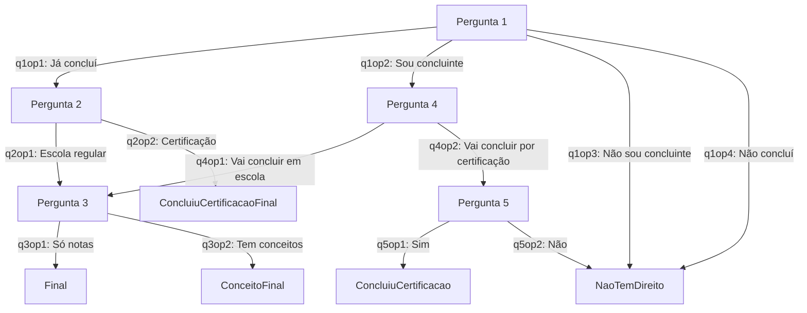

# Fluxo de Perguntas do Formulário – Documentação Detalhada

Este documento descreve detalhadamente o fluxo de perguntas e respostas do formulário de verificação de documentos necessários para participação em processo seletivo por histórico escolar.

---

## Sumário

- [Visão Geral](#visão-geral)
- [Estrutura das Perguntas](#estrutura-das-perguntas)
- [Descrição de Cada Pergunta e Opção](#descrição-de-cada-pergunta-e-opção)
- [Fluxograma Visual](#fluxograma-visual)
- [Respostas Finais](#respostas-finais)
- [Observações](#observações)

---

## Visão Geral

O formulário é composto por uma sequência de perguntas condicionais. Cada resposta pode direcionar o usuário para uma nova pergunta ou apresentar uma resposta final, baseada nas regras definidas em `src/assets/formConfig.js` e nos textos de `src/assets/messageConfig.js`.

---

## Estrutura das Perguntas

Cada pergunta possui:
- **question**: Texto da pergunta.
- **options**: Opções de resposta, cada uma com:
  - **text**: Texto apresentado ao usuário.
  - **next**: (opcional) Próxima pergunta a ser exibida.
  - **response**: (opcional) Resposta final a ser exibida.
  - **visible**: Define se a opção está visível no momento.

---

## Descrição de Cada Pergunta e Opção

### Pergunta 1: Sobre a conclusão do Ensino Médio

| Opção | Texto | Próxima Etapa/Resposta |
|-------|-------|-----------------------|
| q1op1 | Eu **já concluí** o Ensino Médio. | Vai para Pergunta 2 |
| q1op2 | Sou concluinte. Estou no último ano/série/fase/período do Ensino Médio. | Vai para Pergunta 4 *(invisível por padrão)* |
| q1op3 | Não sou concluinte. Ainda falta mais de um ano/série/fase/período para eu concluir. | Resposta: Não tem direito *(invisível por padrão)* |
| q1op4 | Eu **não concluí** o Ensino Médio. | Resposta: Não tem direito |

---

### Pergunta 2: Sobre o Ensino Médio

| Opção | Texto | Próxima Etapa/Resposta |
|-------|-------|-----------------------|
| q2op1 | Eu conclui o Ensino Médio em uma escola (escola regular, Instituto Federal, escola técnica, EJA, EJA EAD, Projeto Mundiar etc.). | Vai para Pergunta 3 e mostra instruções de documentos |
| q2op2 | Eu conclui o Ensino Médio prestando uma prova/exame de certificação (ENCEJJA/ENEM/Exames Supletivos). | Resposta: Documentos para certificação + instruções finais |

---

### Pergunta 3: Sobre o histórico escolar

| Opção | Texto | Próxima Etapa/Resposta |
|-------|-------|-----------------------|
| q3op1 | Não. Todos os desempenhos são notas (números). | Resposta: Instruções finais |
| q3op2 | Sim. Existem conceitos. | Resposta: Documentos para conceitos + instruções finais |

---

### Pergunta 4: Sobre o Ensino Médio (para concluintes)

| Opção | Texto | Próxima Etapa/Resposta |
|-------|-------|-----------------------|
| q4op1 | Eu irei concluir o Ensino Médio em uma escola (escola regular, Instituto Federal, escola técnica, EJA, EJA EAD, Projeto Mundiar etc.). | Vai para Pergunta 3 e mostra instruções de documentos |
| q4op2 | Eu irei concluir o Ensino Médio prestando uma prova/exame de certificação (ENCEJJA/ENEM/Exames Supletivos). | Vai para Pergunta 5 |

---

### Pergunta 5: Prova/exame de certificação

| Opção | Texto | Próxima Etapa/Resposta |
|-------|-------|-----------------------|
| q5op1 | Sim. | Resposta: Documentos para certificação |
| q5op2 | Não. | Resposta: Não tem direito |

---

## Fluxograma Visual

---

## Respostas Finais

- **NaoTemDireito:**  
  O usuário não tem direito a participar do processo seletivo.

- **ConcluiuCertificacaoFinal:**  
  Documentos necessários para quem concluiu por certificação + instruções finais.

- **Final:**  
  Instruções finais para quem concluiu em escola regular.

- **ConceitoFinal:**  
  Documentos necessários para quem possui conceitos no histórico + instruções finais.

- **ConcluiuCertificacao:**  
  Documentos necessários para quem irá concluir por certificação.

---

## Observações

- As opções com `visible: false` não aparecem para o usuário, mas podem ser ativadas futuramente.
- O fluxo pode ser facilmente alterado editando o arquivo `src/assets/formConfig.js`.
- Os textos das respostas finais estão definidos em `src/assets/messageConfig.js`.
- Recomenda-se manter esta documentação atualizada sempre que houver mudanças no fluxo.

---